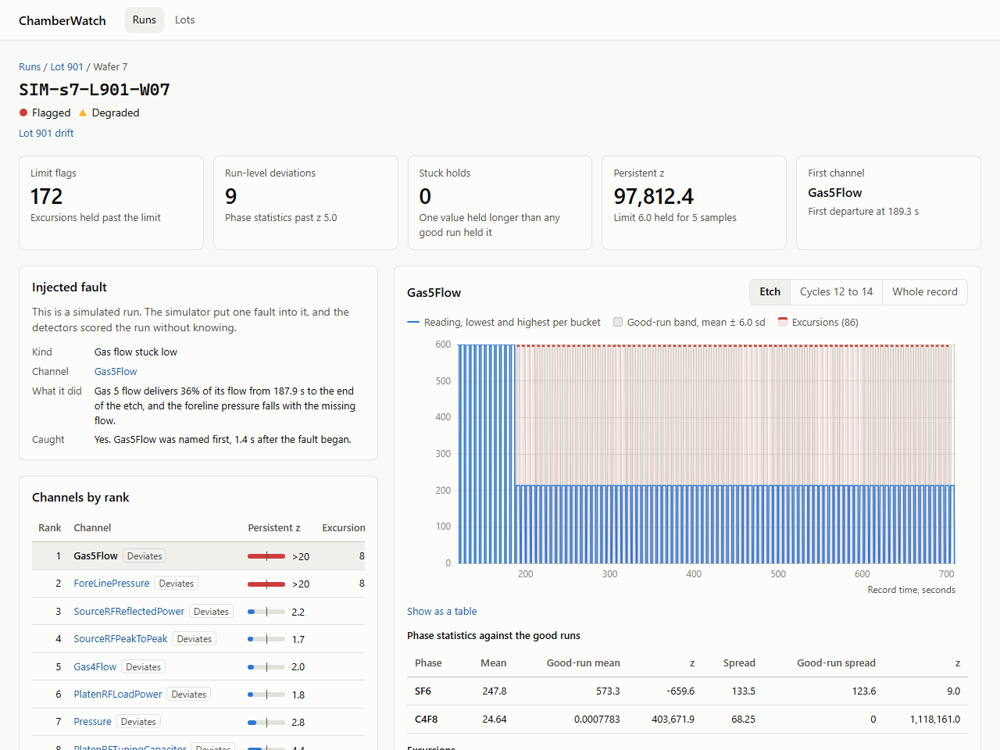

# ChamberWatch

ChamberWatch watches a plasma etch chamber.

It learns what a good wafer looks like from the first few after a chamber clean, then flags later wafers that leave that band and names the sensor that left first. For every flag it puts the sensor next to the measured etch depth on that wafer.


## What it found

On 96 public wafers it did not find scrap. It found the tool changing through the lot.

15 wafers are flagged, all on the two platen match capacitors, all in lots 6 to 9, starting at wafer 4 or later. Those wafers etched no shallower than unflagged wafers at the same position. Depth *does* follow lot position: mean depth loss grows to 0.90 µm by wafer 10, and the SF6-phase mean of the platen tuning capacitor correlates at −0.80 with measured depth inside lots. By the last wafer of every lot that capacitor is outside the good-run band.


The public set has no labeled faults, so a seeded simulator plants five known failures in 1,000 synthetic runs. Detectors catch a stuck gas flow and a sensor dropout every time, a frozen sensor 24 times in 25, and some of the short pressure spikes and slow reflected-power rises. They name the right channel when they catch it. A stuck flow also drags the simulated foreline pressure down, by the 0.21 per sccm the public wafers show, and the flow still ranks above the pressure it moved in all 23 runs where both are flagged. About 14% of clean synthetic runs still get flagged. A stored simulated lot shows the same thing in the app, with the planted fault next to what the detectors called.



The numbers live in [results/metrics.json](results/metrics.json). How the simulator and the score are built is in [docs/EVALUATION.md](docs/EVALUATION.md).

## How it works

The tool records 31 channels five times a second. Nothing in the record says which recipe step a sample belongs to, and the etch starts at a different moment in every file.

1. **Align.** Gas flows and source power mark the recipe. Every sample lands on a fixed grid of 100 cycles (30 SF6 slots and 10 C4F8 slots each), so two wafers can be compared at the same point.
2. **Learn a band.** Wafers 1–3 of each lot — the ones closest to the chamber clean — set a mean and a spread per channel and slot.
3. **Score.** A later wafer is flagged if a channel stays more than 6 standard deviations out for 5 samples, if a phase mean or spread sits more than 5 standard deviations from the good runs, or if a sensor freezes longer than any good run did. Channels are ranked so the earliest departure comes first. Lot drift fits each channel’s SF6-phase mean against position in the lot.

This is a per-slot baseline plus three rules, not a trained model. [docs/DESIGN.md](docs/DESIGN.md) is the full design. [docs/PLAN.md](docs/PLAN.md) is what comes next.

## Data

96 wafers in 10 lots, 31 tool channels at 5 Hz, and etch depth on each wafer. The files are not in this repository. [docs/DATA.md](docs/DATA.md) covers the source, the download, and the quirks the code handles.

## Layout

| Path | Contents |
|---|---|
| `backend/` | Java 21, Spring Boot 4.1, PostgreSQL with Flyway migrations |
| `frontend/` | React, TypeScript, Vite |
| `docs/` | Data, design, evaluation, and the README screenshots |
| `results/` | Committed evaluation metrics and the public drift report |

## Running it locally

You need JDK 21, Node 22.12 or newer, and Docker.

```bash
cd backend
./mvnw test                    # unit tests, plus database tests against a throwaway Postgres container
./mvnw package -DskipTests

# Align the public wafers and print one line per wafer. Needs no database.
java -jar target/chamberwatch.jar align --data=../data/public/zenodo17122442 --md5=../docs/zenodo17122442.md5

# Start Postgres on port 55432, then load the public data, fit a baseline and score every wafer.
# A second run reads nothing, reuses the baseline and adds no rows.
docker compose up -d
java -jar target/chamberwatch.jar ingest --data=../data/public/zenodo17122442 --md5=../docs/zenodo17122442.md5

# Store a seeded synthetic lot with five known faults, plus the clean training lots its baseline learns from.
java -jar target/chamberwatch.jar simulate-lot --seed=7 --lot=901

# Write the drift-versus-depth report for the public data next to the metrics file.
java -jar target/chamberwatch.jar report --out=../results/public-drift.json

# Serve the API on port 8080. OpenAPI is at /v3/api-docs. Add --server.port=18080 if 8080 is taken.
java -jar target/chamberwatch.jar

# Score the detectors on 1,000 simulated wafers and compare with results/metrics.json.
./mvnw test -Dtest=EvaluationRegressionTest
```

```bash
cd frontend
npm install
npm run dev     # http://localhost:5173, proxying /api to the backend on port 8080
npm test        # unit tests
npm run e2e     # build, then drive the built app in Chromium against captured API responses
```

If the backend runs on another port: `CHAMBERWATCH_API=http://localhost:18080 npm run dev`.

The screenshots above come from the built app and the captured API responses: `npm run build && SCREENSHOTS=1 npx playwright test e2e/screenshots.spec.ts`. The responses come from the real API: with the public wafers ingested and `simulate-lot --seed=7 --lot=901` stored, `node e2e/capture-fixtures.mjs http://localhost:8080` writes every file in `e2e/fixtures` again.

## License

The code is under the [MIT License](LICENSE). The dataset is not in this repository; it is published on Zenodo under CC BY 4.0, and [docs/DATA.md](docs/DATA.md) cites it.
