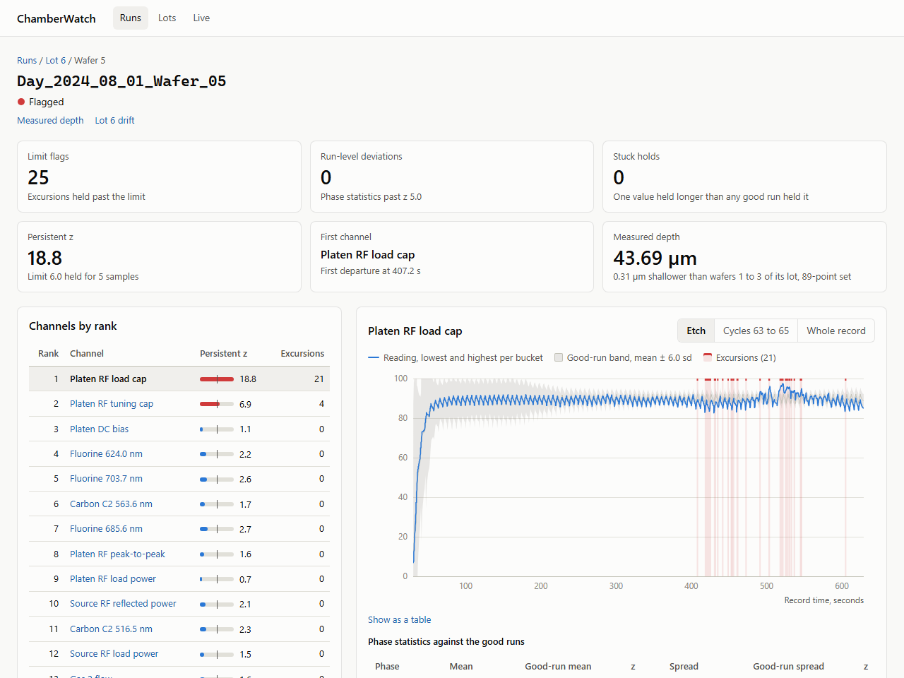
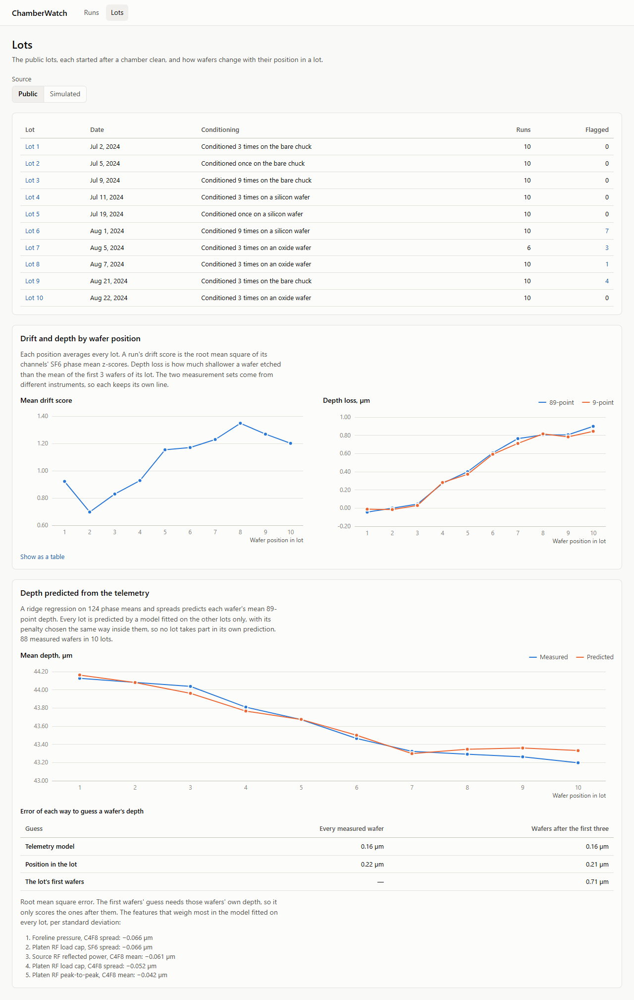
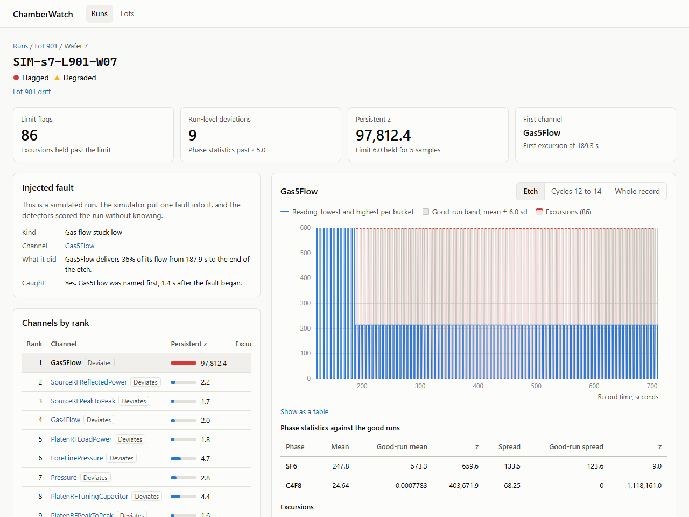

# ChamberWatch

Tool-health monitoring for a plasma etch tool. ChamberWatch reads each wafer's machine telemetry, learns what a good run looks like at each point in the recipe, and flags runs that go out of range or drift across a lot. For every flag it shows which sensor changed first, next to the measured result on the wafer.



Status: v1 is complete. The aligner places all 96 public wafers on a fixed recipe grid, the ingest loads their 10.1 million samples into PostgreSQL, the detectors score every wafer against a baseline learned from the first wafers of each lot, and the ingest stores those scores. A seeded simulator makes wafers with known faults, and CI scores the detectors on 1,000 of them ([results/metrics.json](results/metrics.json), [docs/EVALUATION.md](docs/EVALUATION.md)). An HTTP API serves the runs table, each run's ranked channels and charts, wafer measurements, relabeling, lot drift and a drift-versus-depth report. A React app covers the runs table, each run's trace against the good-run band, each lot's drift channel by channel, each wafer's depth map, and drift against depth by wafer position. A `simulate-lot` command stores a seeded synthetic lot with four known faults next to the clean lots its baseline learns from, with the injected fault kept beside each run; the app switches between the public and the simulated wafers and shows each injected fault next to what the detectors caught. `report` writes the drift-versus-depth report to a file ([results/public-drift.json](results/public-drift.json)). [docs/DESIGN.md](docs/DESIGN.md) describes the whole design, and [docs/PLAN.md](docs/PLAN.md) what comes next: the design's open questions, a hosted demo, predicted depth, the emission spectra, and a chamber simulator in C.

## How it works

The tool records 31 channels five times a second, but nothing in the record says which recipe step a sample belongs to, and the etch starts at a different moment in every record. The aligner reads the gas flows and the source power to place every sample on a fixed grid of 100 cycles, 30 SF6 slots and 10 C4F8 slots each, so two wafers can be compared at the same point in the recipe. A baseline learns a mean and a spread per channel and slot from the first three wafers of each lot, the ones closest to the chamber clean. The limit detector flags a channel that stays more than 6 standard deviations out for 5 samples in a row, the run-level detector flags a phase mean or spread that sits more than 5 standard deviations from the good runs, and the channels are ranked so the earliest departure comes first, since later departures are often its effects. Lot drift fits each channel's SF6 phase mean against position in the lot and projects the line to the edge of the band. Every score is stored against the baseline that produced it, so relabeling a wafer refits and rescores without locking readers, and a baseline fitted from the same good runs and settings is reused by its fingerprint.

## What it found on the public data

15 of the 96 wafers are flagged, all by the limit detector and all on the two platen match capacitors, in lots 6 to 9, starting at wafer 4 or later and earlier in the etch with each wafer. Those wafers etched no shallower than unflagged wafers at the same position, so the flags mark a change in the tool, not a bad wafer. What does follow the wafers is drift: the SF6 phase mean of PlatenRFTuningCapacitor correlates at -0.80 with measured depth within lots, is outside the good-run band by the last wafer of every lot, and the mean depth loss grows to 0.90 µm by wafer 10 while the mean drift score rises from 0.8 to 1.36.



The public data labels no faults, so the detectors are scored on simulated wafers with known ones. On 1,000 simulated runs with 100 faults, recall is 1.00 for a gas flow stuck low and a sensor dropout and 0.88 for a pressure spike and a reflected power rise, precision is 1.00 for every kind, and 13.7 % of clean runs are flagged. A stored simulated lot shows the same thing in the app, with the injected fault next to what the detectors caught.



## Data

ChamberWatch runs on a public plasma etch dataset: 96 wafers in 10 lots, 31 tool channels sampled 5 times a second, and etch depth measured on each wafer. [docs/DATA.md](docs/DATA.md) covers the source, the download, and the quirks the code handles. The data files are not in this repository.

## Layout

| Path | Contents |
|---|---|
| `backend/` | Java 21, Spring Boot 4.1, PostgreSQL with Flyway migrations |
| `frontend/` | React, TypeScript, Vite |
| `docs/` | Notes on the data, the design and the evaluation, and the README screenshots |
| `results/` | The committed evaluation metrics and the public drift report |

## Running it locally

You need JDK 21, Node 22.12 or newer, and Docker.

```bash
cd backend
./mvnw test                    # unit tests, plus database tests against a throwaway Postgres container
./mvnw package -DskipTests

# Align the public wafers and print one line per wafer. Needs no database.
java -jar target/chamberwatch.jar align --data=../data/public/zenodo17122442 --md5=../docs/zenodo17122442.md5

# Start Postgres on port 55432, then load the public data, fit a baseline and score every wafer.
# A second run reads nothing, reuses the baseline and adds no rows.
docker compose up -d
java -jar target/chamberwatch.jar ingest --data=../data/public/zenodo17122442 --md5=../docs/zenodo17122442.md5

# Store a seeded synthetic lot with four known faults, plus the clean training lots its baseline learns from. A rerun adds nothing.
java -jar target/chamberwatch.jar simulate-lot --seed=7 --lot=901

# Write the drift-versus-depth report for the public data next to the metrics file.
java -jar target/chamberwatch.jar report --out=../results/public-drift.json

# Serve the API on port 8080, with the OpenAPI description at /v3/api-docs. Add --server.port=18080 if 8080 is taken.
java -jar target/chamberwatch.jar

# Score the detectors on 1,000 simulated wafers and compare with results/metrics.json. Needs no data and no database.
./mvnw test -Dtest=EvaluationRegressionTest

# Measure the simulator's template from the public wafers again, over the committed one.
java -jar target/chamberwatch.jar sim-template --data=../data/public/zenodo17122442 --md5=../docs/zenodo17122442.md5
```

```bash
cd frontend
npm install
npm run dev     # http://localhost:5173, passing /api to the backend on port 8080
npm test        # unit tests
npm run e2e     # build, then drive the built app in Chromium against API responses captured from the public data
```

If the backend runs on another port, point the dev server at it with `CHAMBERWATCH_API=http://localhost:18080 npm run dev`.

The screenshots above come from the built app and the captured API responses: `npm run build && SCREENSHOTS=1 npx playwright test e2e/screenshots.spec.ts`.

## License

The code is under the [MIT License](LICENSE). The dataset is not in this repository; it is published on Zenodo under CC BY 4.0, and [docs/DATA.md](docs/DATA.md) cites it.
